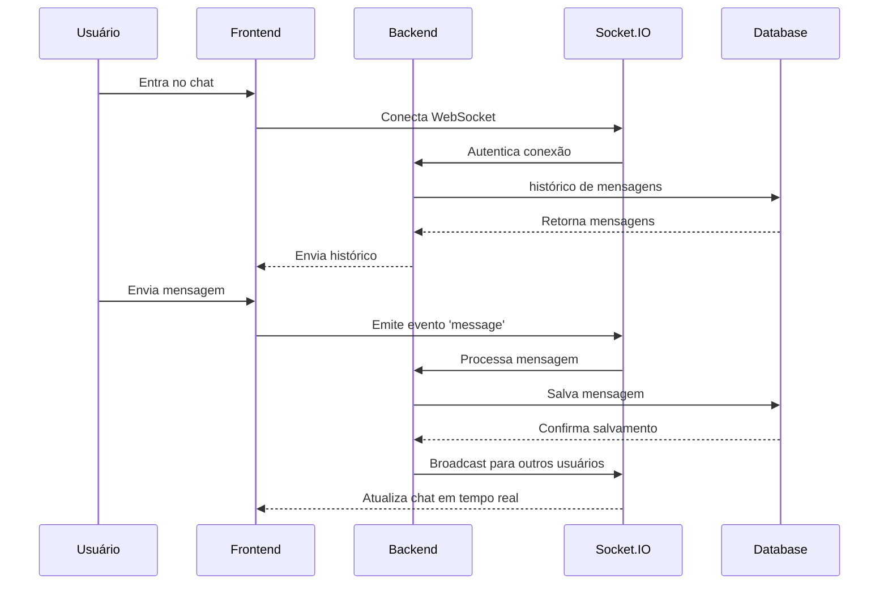

# Chat em Tempo Real

Este é um projeto de chat em tempo real construído com Node.js, Socket.IO, Next.js e MongoDB.

## 🚀 Funcionalidades

- Autenticação de usuários (registro/login)
- Chat em tempo real
- Notificações sonoras de novas mensagens
- Interface responsiva com Tailwind CSS

## 🔧 Tecnologias

### Backend
- Node.js
- Express
- Socket.IO
- Passport.js
- MongoDB
- Multer (upload de arquivos)

### Frontend
- Next.js
- Tailwind CSS
- Socket.IO Client
- Axios

## 📋 Pré-requisitos

- Node.js
- MongoDB
- Docker (opcional)

## 🔨 Instalação e Execução

### Sem Docker

1. **Backend**
```bash
cd backend
npm install
npm run dev
```

2. **Frontend**
```bash
cd frontend
npm install
npm run dev
```

O frontend estará disponível em `http://localhost:3000` e o backend em `http://localhost:4000`

### Com Docker

1. **Execute o projeto completo**
```bash
docker compose up --build
```

Para parar os containers e remover volumes:
```bash
docker compose down -v
```

Para remover completamente os containers, volumes e imagens:
```bash
# Para os containers e remove volumes
docker compose down -v

# Remove as imagens do projeto
docker rmi realtime-chat-project-frontend realtime-chat-project-backend

# Opcional: remove todas as imagens não utilizadas
docker image prune -a
```

## 📝 Diagrama de Sequência



## 🛠️ Configuração

### Variáveis de Ambiente

**Backend (.env)**
```env
MONGODB_URI=mongodb://localhost:27017/chat
SESSION_SECRET=
PORT=4000
FRONTEND_URL=
```

**Frontend (.env)**
```env
NEXT_PUBLIC_API_URL=http://localhost:4000
NEXT_PUBLIC_SOCKET_URL=http://localhost:4000
NEXT_PUBLIC_DOCKER=1
NEXT_PUBLIC_API_URL=/api
```

## 📁 Estrutura do Projeto

### Backend
- `src/`
  - `auth/` - Configuração do Passport.js
  - `models/` - Modelos do MongoDB
  - `routes/` - Rotas da API
  - `socket/` - Lógica do Socket.IO
  - `utils/` - Funções utilitárias

### Frontend
- `components/` - Componentes React
- `pages/` - Páginas Next.js
- `services/` - Serviços de API
- `styles/` - Estilos CSS
- `utils/` - Funções utilitárias

## 👤 Contribuição

1. Faça o fork do projeto
2. Crie sua feature branch (`git checkout -b feature/nome-da-feature`)
3. Commit suas mudanças (`git commit -m 'Adiciona nova feature'`)
4. Push para a branch (`git push origin feature/nome-da-feature`)
5. Abra um Pull Request

## 📄 Licença

Este projeto está sob a licença MIT. Veja o arquivo [LICENSE](LICENSE) para mais detalhes.
